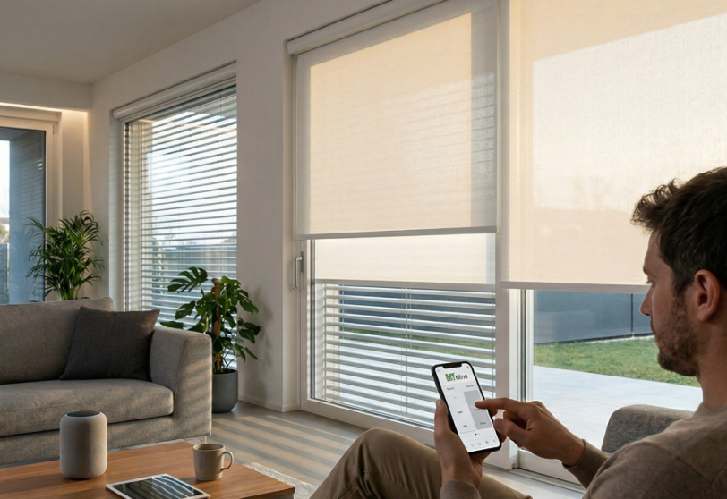



Custom component Home Assistant (HACS) per gestione avanzata tende/tapparelle con logiche adattive, robustezza BUSPRO/Nuki e profili operativi orientati a installazioni reali.

## Stato progetto
- Versione: `0.1.1`
- Fase: prima versione funzionale (config flow + controllo sole base)
- Obiettivo attuale: base installabile + tracking sviluppo

## Installazione da HACS
1. HACS -> Integrations -> menu `...` -> `Custom repositories`
2. Repository: `https://github.com/edmondoalex/e-tende-intelligenti`
3. Category: `Integration`
4. Installare `e-Tende Intelligenti`
5. Riavviare Home Assistant

## Struttura
- `custom_components/e_tende_intelligenti/` codice integrazione
- `docs/` note operative
- `CHANGELOG.md` storico versioni
- `DEVELOPMENT_LOG.md` diario sviluppo incrementale
- `DECISIONS.md` decisioni tecniche (ADR light)
- `ROADMAP.md` piano evolutivo

## Note
Questa versione e un bootstrap tecnico. Le funzionalita applicative (profili sole, bypass sicuro, UI per-singola-cover, anti-rimbalzo) verranno introdotte nei prossimi incrementi.

## Guida dettagliata
- Vedi [docs/COMPONENT_GUIDE.md](docs/COMPONENT_GUIDE.md)

